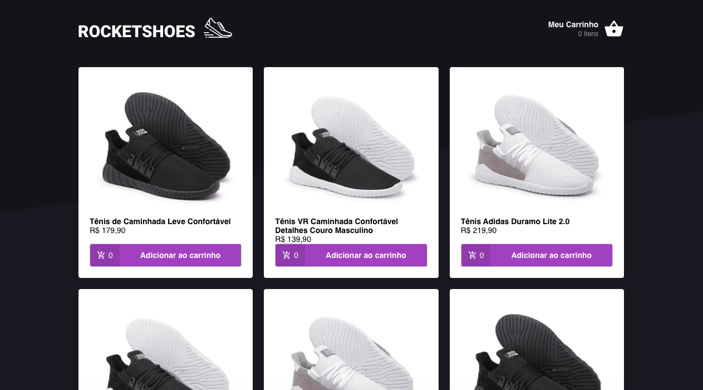
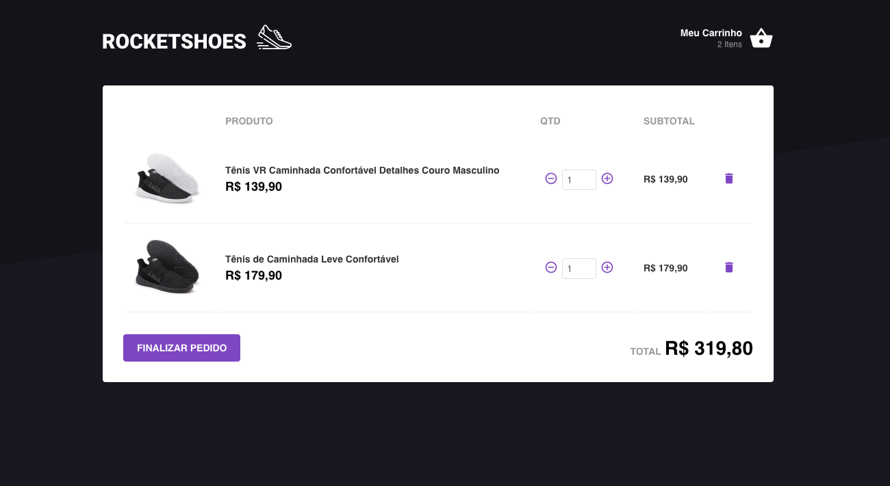

<h1 align="center">
  
</h1>

<h1 align="center">
  
</h1>

<h3 align="center">
  React Project
</h3>

 Projeto criado durante o bootcamp goStack da Rocketseeat. Trata-se de um e-commerce desenvolvido para estudos das libs Redux, Redux Saga e React Hooks. 

<blockquote align="center">“Não espere para plantar, apenas tenha paciência para colher”!(Rocketseat, 2020)</blockquote>

### **How to use**

- 1: Run<strong> yarn</strong> ( install all dependencies);
- 2: Run<strong> yarn start</strong> ( Run server );

Qualquer dúvida só me comunicar =] (tiagohenriquequeiroz@gmail.com)
